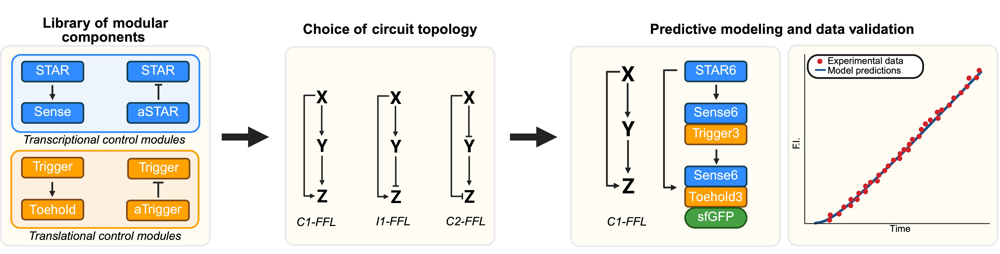

# Modeling Suite for TXTL Systems
This repository accompanies the manuscript [**<ins>Engineering RNA-based Feedforward Loops in
TXTL</ins>**]() by **Alina Kuzembayeva1,2,3,\$, Jérémie J. M. Marlhens1,2,3,\$, Erik Kubaczka1,3, İrem
Ergenlioğlu1,23, and Heinz Koeppl1,3***, currently available as preprint on bioRxiv.

1. Centre for Synthetic Biology, TU Darmstadt, Darmstadt 64283, Germany
2. Graduate School Life Science Engineering, TU Darmstadt, Darmstadt 64283, Germany
3. Department of Electrical Engineering and Information Technology, TU Darmstadt, Darmstadt 64283, Germany

$ These authors contributed equally to this research. \
*Corresponding author Heinz Koeppl (heinz.koeppl@tu-darmstadt.de).

 
_Abstract Figure_